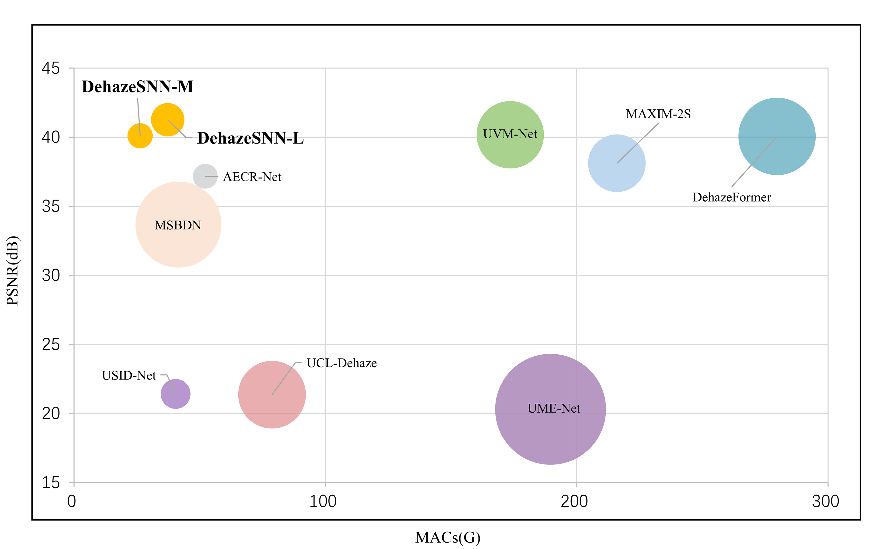
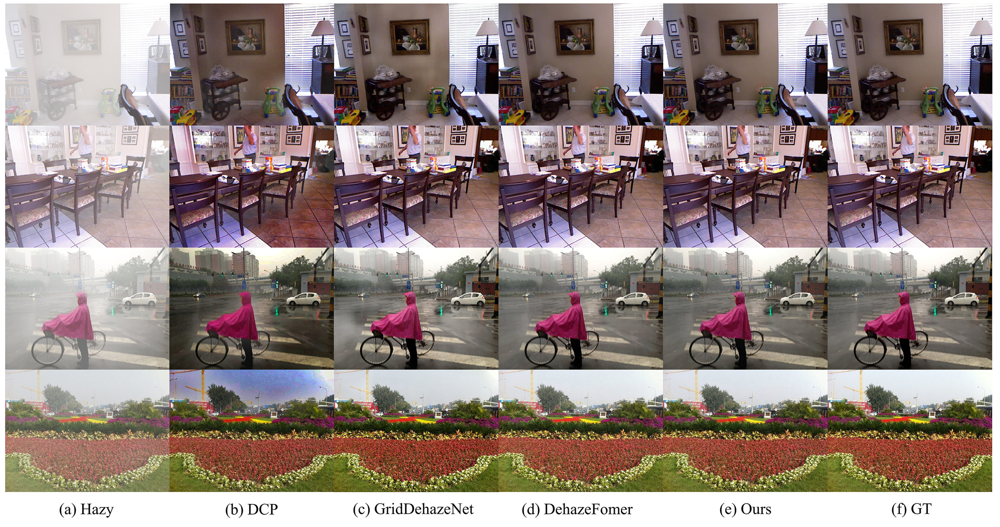

# DehazeSNN

> Spiking-UNet for image dehazing with Orthogonal Leaky-Integrate-and-Fire (OLIF) blocks.

## Abstract
Image dehazing enhances image clarity under haze. Conventional methods rely on atmospheric models; recent CNNs and Transformers improve results but either miss long-range dependencies (CNNs) or are compute-heavy (Transformers). DehazeSNN integrates a U-Net-like design with Spiking Neural Networks (SNNs), using an Orthogonal Leaky-Integrate-and-Fire Block (OLIFBlock) to strengthen cross-channel communication. This yields competitive dehazing with fewer parameters and MACs.

## Highlights
- **Spiking + U-Net**: U-Net-like encoder–decoder with SNN-based processing.
- **OLIFBlock**: Efficient cross-channel communication.
- **Multi-scale features**: Handles local and long-range dependencies.
- **Efficient**: Smaller model size and MACs with strong quality.
- **Models**: `DehazeSNN-S`, `DehazeSNN-M`, `DehazeSNN-L`.

## Demos



---

## Installation
Tested with PyTorch 2.1.2, CUDA 12.1, cuDNN 8.9, Python 3.11, NVIDIA GPU.

Important: The custom LIF CUDA kernel depends on CuPy for CUDA 12.x (`cupy-cuda12x`). CPU-only is not supported.

### 1) Create environment
```bash
conda create -n DehazeSNN python=3.11.7 -y
conda activate DehazeSNN
```

### 2) Install PyTorch (CUDA 12.1)
Recommended (Conda):
```bash
conda install pytorch=2.1.2 torchvision torchaudio pytorch-cuda=12.1 -c pytorch -c nvidia -y
```
Alternative (pip):
```bash
pip install --index-url https://download.pytorch.org/whl/cu121 torch==2.1.2 torchvision==0.16.2 torchaudio==2.1.2
```

### 3) Install Python dependencies
If you installed PyTorch via Conda, install the remaining packages via pip:
```bash
pip install PyYAML timm tqdm opencv-python cupy-cuda12x lpips pytorch_msssim
```
Or use the provided requirements (note: it also lists torch/vision/audio):
```bash
pip install -r requirements.txt
```

### 4) Prepare logging directory
Both training and testing write logs under `--output/log`. Create it once before running:

- Linux/macOS: `mkdir -p ./output/log`
- PowerShell: `New-Item -ItemType Directory -Force .\output\log`

---

## Data and Checkpoints
- Pretrained models and example results: [Zenodo](https://doi.org/10.5281/zenodo.15486831)
- Datasets: [RESIDE](https://sites.google.com/view/reside-dehaze-datasets/reside-standard?authuser=0), [RE-HAZE (RS-HAZE)](https://github.com/IDKiro/DehazeFormer)

Expected layout:
```text
saved_models/
  ├─ indoor/
  │   ├─ DehazeSNN-M_best.pth
  │   └─ ...
  ├─ outdoor/
  ├─ reside6k/
  └─ rshaze/

datasets/
  ├─ indoor/
  │  ├─ train/
  │  │  ├─ GT/      # clean images
  │  │  └─ hazy/    # corresponding hazy images
  │  └─ test/
  │     ├─ GT/
  │     └─ hazy/
  ├─ outdoor/
  ├─ reside6k/
  └─ rshaze/
```
- The dataloader expects paired files with identical names under `GT/` and `hazy/`.

---

## Quick Start
Evaluate a pretrained model (example: RS-HAZE with `DehazeSNN-M`):
```bash
python test.py \
  --model DehazeSNN-M \
  --exp rshaze \
  --dataset rshaze \
  --data_dir ./datasets/ \
  --save_dir ./saved_models/ \
  --result_dir ./output/results/ \
  --gpu 0
```
Images are saved to `output/results/<dataset>/<model>/imgs/` and metrics to `output/results/<dataset>/<model>/results.csv`.

Evaluate the last 20 saved epochs as well:
```bash
python test.py --model DehazeSNN-M --exp rshaze --dataset rshaze --last_20 true --gpu 0
```

---

## Training
Choose an experiment config from `configs/<exp>/` and a model size.

Common options:
- `--model`: `DehazeSNN-S | DehazeSNN-M | DehazeSNN-L`
- `--exp`: `indoor | outdoor | reside6k | rshaze` (must match a folder in `configs/`; on Linux/macOS, `--exp` must match `configs/<exp>/` exactly)
- `--dataset`: dataset folder name under `datasets/` (usually same as `--exp`)
- `--gpu`: GPU ids, e.g., `"0"` or `"0,1"`
- `--resume`: `true|false` (resume from `_current.pth`)
- `--fine_tuning`: `true|false` (adjusts lrs/epochs for fine-tuning)
- `--loss`: `L1 | LPIPS | weight` (if `weight`, set `--weight 0.5` etc.)
- `--accumulation_steps`: gradient accumulation for large images

Example (train `DehazeSNN-M` on RESIDE-6K):
```bash
python train.py \
  --model DehazeSNN-M \
  --exp reside6k \
  --dataset reside6k \
  --data_dir ./datasets/ \
  --save_dir ./saved_models/ \
  --output ./output/ \
  --gpu 0 \
  --resume false
```
Example (SOTS-Indoor):
```bash
python train.py --model DehazeSNN-M --exp indoor --dataset indoor --gpu 0
```
Checkpoints are saved to `saved_models/<exp>/` as `_best.pth`, `_current.pth`, `_last.pth`, and optional `_epoch_XXX.pth` (last ~20 epochs).

Note on configs for `DehazeSNN-S`: add `configs/<exp>/DehazeSNN-S.json` (copy and adapt from `DehazeSNN-M.json`), otherwise training will not find the config.

---

## Configuration Reference
Each JSON in `configs/<exp>/` controls training:
- `batch_size`: global batch size
- `patch_size`: crop size during training/validation
- `valid_mode`: `valid` uses centered crops; `test` runs full-size
- `edge_decay`, `only_h_flip`: augmentation knobs
- `epochs`, `eval_freq`: total epochs and validation frequency
- Optimizer and schedule:
  - `TRAIN_BASE_LR`, `TRAIN_LIF_LR`, `TRAIN_WEIGHT_DECAY`, `LIF_WEIGHT_DECAY`
  - `TRAIN_WARMUP_EPOCHS`, `TRAIN_LR_SCHEDULER` (cosine), `TRAIN_MIN_LR`, `TRAIN_WARMUP_LR`
  - `TRAIN_OPTIMIZER_EPS`, `TRAIN_OPTIMIZER_BETAS`

Model hyperparameters (e.g., depths, dims) are defined in code under `models/` per size S/M/L.

---

## Single-image Inference (optional)
If you have a paired test set, use `test.py`. For ad‑hoc single images, you can adapt `test.py` or write a short script to:
1) Load the model and checkpoint, 2) read an RGB image, scale to `[−1,1]`, 3) forward, 4) clamp and rescale to `[0,1]`, 5) save. See utilities in `utils/common.py` (`read_img`, `write_img`).

---

## Troubleshooting
- "No module named cupy" or CUDA errors: install `cupy-cuda12x` matching your CUDA and Python. Ensure an NVIDIA driver supporting CUDA 12.1 is installed.
- PyTorch/CUDA mismatch: verify PyTorch was installed with CUDA 12.1 (Conda: `pytorch-cuda=12.1`; pip: `cu121` wheels).
- OOM during training: reduce `batch_size`, increase `--accumulation_steps`, lower `patch_size`.
- Dataloader file errors: ensure paired filenames under `GT/` and `hazy/` are identical.
- Multi-GPU: pass `--gpu "0,1,..."`. Training uses `nn.DataParallel`.
- Logger path: ensure `--output` exists and contains a `log/` subfolder (e.g., on Windows PowerShell: `New-Item -ItemType Directory -Force .\output\log`).

---

## Acknowledgements
This repo builds on the CUDA C++ kernel implementation from the following paper:
```bibtex
@inproceedings{li2022brain,
  title={Brain-inspired multilayer perceptron with spiking neurons},
  author={Li, Wenshuo and Chen, Hanting and Guo, Jianyuan and Zhang, Ziyang and Wang, Yunhe},
  booktitle={Proceedings of the IEEE/CVF Conference on Computer Vision and Pattern Recognition},
  pages={783--793},
  year={2022}
}
```

## Citation
If you find this work useful, please cite our paper:
```bibtex
@INPROCEEDINGS{11228727,
  author={Li, Huibin and Liu, Haoran and Liu, Mingzhe and Xiao, Yulong and Li, Peng and Zan, Guibin},
  booktitle={2025 International Joint Conference on Neural Networks (IJCNN)}, 
  title={U-Net-Like Spiking Neural Networks for Single Image Dehazing}, 
  year={2025},
  volume={},
  number={},
  pages={1-9},
  keywords={Photography;Image dehazing;Computational modeling;Atmospheric modeling;Scattering;Spiking neural networks;Computer architecture;Transformers;Feature extraction;Remote sensing;Image Dehazing;Leaky-Integrate-and-Fire;Remote Sensing;Spiking Neural Networks},
  doi={10.1109/IJCNN64981.2025.11228727}}
```

## License
This project is released under the terms of the license in `LICENSE`.

## Contact
For issues and questions: liuhaoran@cdut.edu.cn


